# Phase 1 — Exploratory Data Analysis & Data Quality

**Date:** 2025-08-27  
**Scope:** EDA and data-quality investigation only. No final model training, no submission files generated.

**Artifacts:** `reports/eda/*.png`, `reports/eda/phase1_stats.json`, `scripts/run_phase1_eda.py`

---

## 1. Dataset Overview

### Phase 0 verification (independently confirmed)

All major Phase 0 findings were **confirmed** against the actual CSV files. No corrections to row counts, columns, date ranges, or missing-value counts were required.

| Check | Result | Phase 0 match? |
|---|---|---|
| Train shape | 48,000 × 14 | Yes |
| Validation shape | 12,000 × 13 | Yes |
| Target column | `posted_rate` (train only) | Yes |
| ID column | `load_id` (48k/12k unique, 0 overlap) | Yes |
| Missing `weight` | 300 train / 165 val | Yes |
| Missing `market_index` | 374 train / 249 val | Yes |
| Negative `weight` | 292 train / 145 val | Yes |
| Train dates | 2025-01-01 → 2025-10-31 | Yes |
| Validation dates | 2025-11-01 → 2025-12-31 | Yes |
| Duplicate rows | 0 (both files) | Yes |
| Unseen validation cities | 8 cities, 725 pickup rows, 722 delivery rows | Yes |
| Distance ↔ target Pearson r | 0.909 | Yes |

**Refinement (not a correction):** Comparing *full* train vs validation `market_index` shows severe drift (KS = 0.48), but **Sep–Oct training mean (0.926) nearly matches Nov–Dec validation mean (0.927)**. The apparent drift is driven largely by mid-year peaks (Apr–Jun mean ≈ 1.26) present in training but absent from the holdout periods.

### Columns

**Train (14):** `load_id`, `pickup`, `delivery`, `pickup_lat`, `pickup_lon`, `delivery_lat`, `delivery_lon`, `distance`, `equipment`, `weight`, `date`, `market_index`, `quote_signal`, `posted_rate`

**Validation (13):** Same minus `posted_rate`.

### Visual reference

Plots saved under `reports/eda/` — see Section 11 at end of document.

---

## 2. Target Analysis

### Summary statistics (`posted_rate`, n = 48,000)

| Statistic | Value |
|---|---:|
| Mean | 2,373.98 |
| Median | 2,030.76 |
| Std | 1,486.49 |
| Min | 57.22 |
| Max | 25,533.00 |
| Q25 | 1,251.55 |
| Q75 | 3,330.75 |
| IQR | 2,079.20 |
| Q95 | 4,953.77 |
| Q99 | 5,972.83 |
| Skewness | 1.90 |
| Excess kurtosis | 13.28 |

Shapiro-Wilk on a 5,000-row sample: p ≈ 1.3×10⁻⁴⁸ → **not normal**.

### Distribution character

- **Right-skewed** (skew = 1.90): mean > median.
- **Heavy-tailed** (kurtosis = 13.3): upper tail extends far beyond Q99.
- **Not approximately normal.**
- 480 loads above Q99; 480 below Q1 (symmetric tail count at 1% level).
- 24 loads above $15,000; 47 loads below $200.
- Top extremes are long-haul loads (distance 2,550–2,830 mi), not obvious data errors.

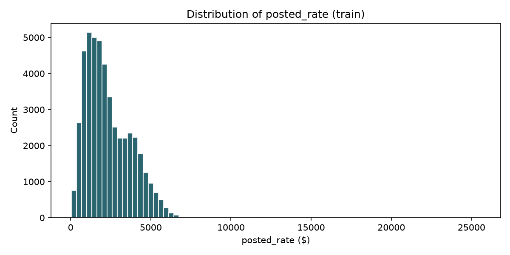

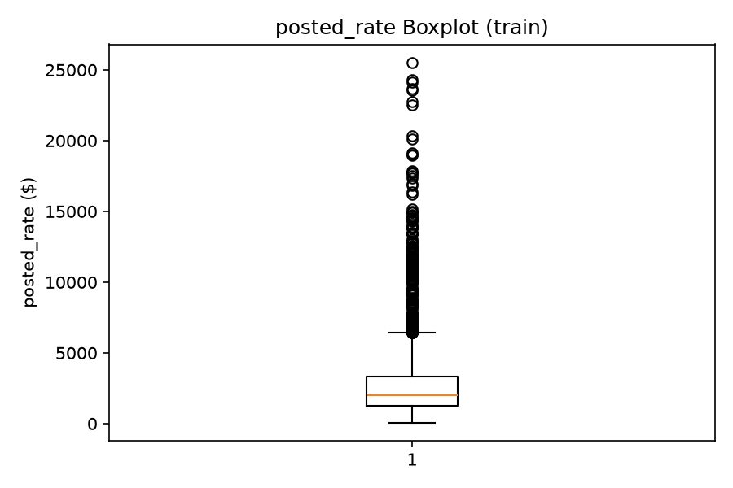

### Monthly target behavior

| Month | Mean | Median | Std | Q25 | Q75 | Count |
|---|---:|---:|---:|---:|---:|---:|
| Jan | 2,256 | 1,915 | 1,454 | 1,171 | 3,133 | 4,918 |
| Feb | 2,274 | 1,994 | 1,317 | 1,237 | 3,185 | 4,337 |
| Mar | 2,372 | 2,023 | 1,463 | 1,248 | 3,356 | 5,036 |
| Apr | 2,372 | 2,044 | 1,463 | 1,271 | 3,340 | 4,819 |
| May | 2,422 | 2,066 | 1,486 | 1,289 | 3,420 | 4,913 |
| Jun | 2,497 | 2,120 | 1,607 | 1,323 | 3,514 | 4,783 |
| Jul | 2,415 | 2,059 | 1,505 | 1,279 | 3,416 | 4,912 |
| Aug | 2,338 | 2,016 | 1,475 | 1,241 | 3,268 | 4,759 |
| Sep | 2,406 | 2,057 | 1,523 | 1,252 | 3,369 | 4,670 |
| Oct | 2,379 | 2,036 | 1,529 | 1,231 | 3,305 | 4,853 |

Peak mean in June (+10% vs January). Monthly medians track means but at lower levels.

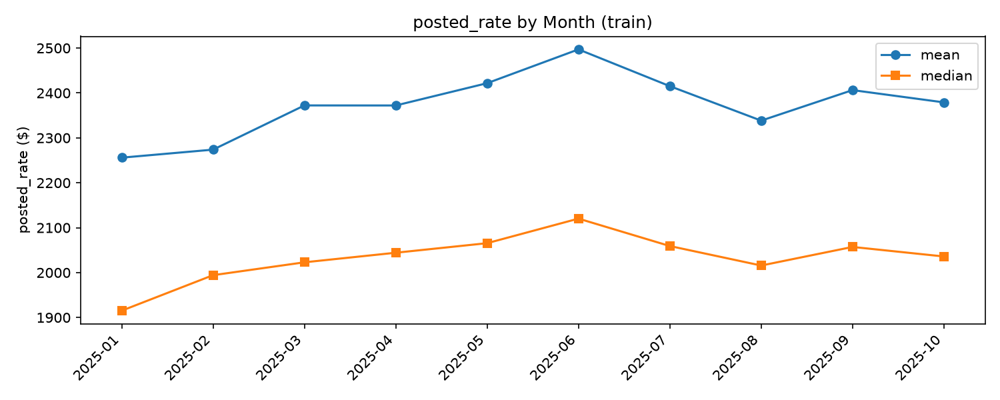

### Implications for metrics and models

- **Do not remove target outliers** — high rates correspond to legitimate long-haul loads.
- **MAE preferred over RMSE** for local development: heavy right tail means RMSE is dominated by rare high-rate loads; MAE is more stable and interpretable in dollars. Existing `src/metrics.py` choice of MAE is appropriate.
- **Model families:** Tree ensembles and regularized linear models on log-transformed distance may both work; constant/median baselines will fail on long-haul tail.
- Heavy tails favor **robust losses (MAE)** or tree models over unregularized squared-error linear models.

---

## 3. Numerical Features

### Overview table (train)

| Feature | Missing % | Nunique | Pearson r | Spearman r | Notes |
|---|---:|---:|---:|---:|---|
| `pickup_lat` | 0.0 | 64 | −0.091 | −0.112 | Redundant with city |
| `pickup_lon` | 0.0 | 63 | −0.255 | −0.197 | Redundant with city |
| `delivery_lat` | 0.0 | 64 | −0.092 | −0.115 | Redundant with city |
| `delivery_lon` | 0.0 | 63 | −0.257 | −0.199 | Redundant with city |
| `distance` | 0.0 | 21,204 | **+0.909** | **+0.976** | Dominant predictor |
| `weight` | 0.625 | 23,678 | +0.035 | +0.042 | Weak; quality issues |
| `market_index` | 0.779 | 32,884 | +0.034 | +0.032 | Weak linear; regime signal |
| `quote_signal` | 0.0 | 37,633 | −0.040 | −0.040 | Weak linear |

### Distance

- Range: 70.0 – 3,439.8 mi (mean 1,136, median 953).
- Linear regression on distance → R² = 0.825 (not fully linear).
- Spearman (0.976) > Pearson (0.909) → monotonic but **nonlinear rate-per-mile decay**.

**Rate per mile by distance bin:**

| Distance bin (mi) | Mean RPM | Median RPM | Count |
|---|---:|---:|---:|
| 0–300 | 2.74 | 2.68 | 3,983 |
| 300–600 | 2.41 | 2.36 | 9,444 |
| 600–1,200 | 2.20 | 2.15 | 16,347 |
| 1,200–2,000 | 2.07 | 2.02 | 10,679 |
| 2,000–5,000 | 1.94 | 1.91 | 7,547 |

Short hauls have **~40% higher RPM** than long hauls → distance-only linear models underfit short loads and overfit long loads.

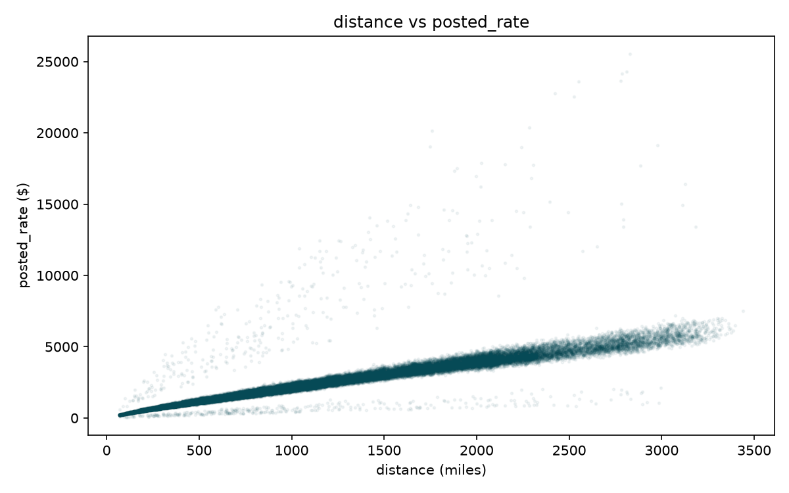

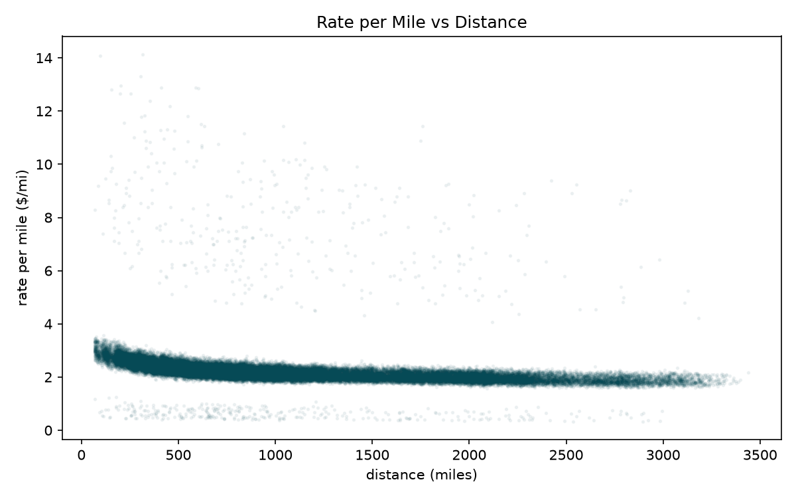

Same route can have multiple distances (3,944 / 4,014 routes); 1,181 route+date groups differ in distance. **Use supplied `distance`**, do not replace with haversine.

### Weight

| Category | Train count |
|---|---:|
| Missing | 300 |
| Negative | 292 |
| Positive (5,000–47,500) | 47,408 |
| Zero | 0 |

- Negative values: 275 unique values, range −47,500 to −70.
- 13 rows at exactly −47,500 (mirror of max positive 47,500).
- Mean target for negative-weight loads: 2,390 vs positive: 2,374 — **no target signal in negativity**.
- Positive-only weight ↔ target: r = 0.042.
- Negative weights spread across equipment proportionally (~53% Dry Van).
- **Conclusion:** Negative weights are **corrupted/sentinel values**, not genuine measurements. Not a encoding of rate information.

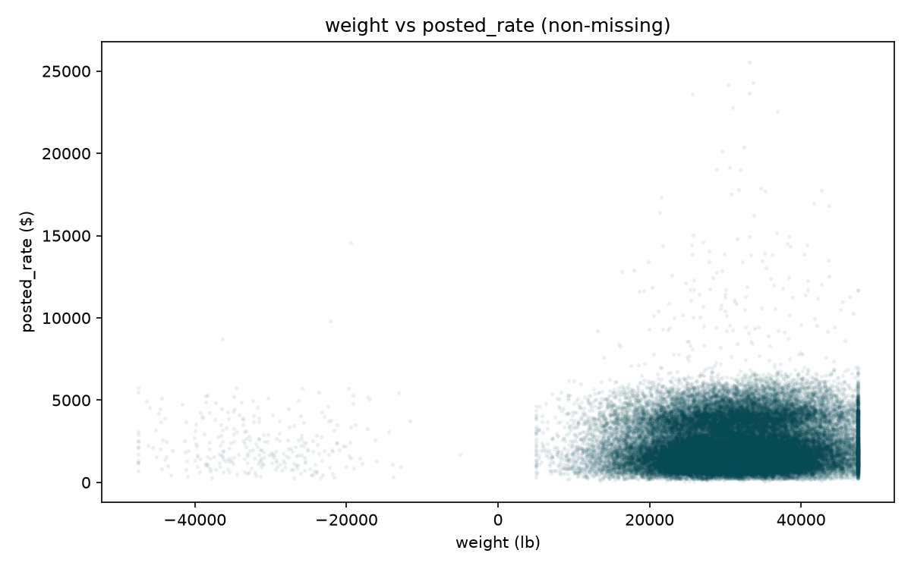

### market_index

- Range: 0.676 – 1.468 (train); highly granular (32,884 unique values).
- Pearson/Spearman with target ≈ 0.03 globally — **low marginal linear correlation**.
- **Strong seasonal/regime pattern over time:**

| Period | Mean market_index |
|---|---:|
| Jan–Mar (train) | 0.999 |
| Apr–Jun (train) | 1.263 |
| Jul–Aug (train) | 1.093 |
| Sep–Oct (train) | 0.926 |
| Nov–Dec (validation) | 0.927 |

Peaks in May (1.301). Validation period aligns with **Sep–Oct regime**, not with full-year train average (1.083).

**Do not drop market_index** — it carries temporal market state even if global correlation is low.

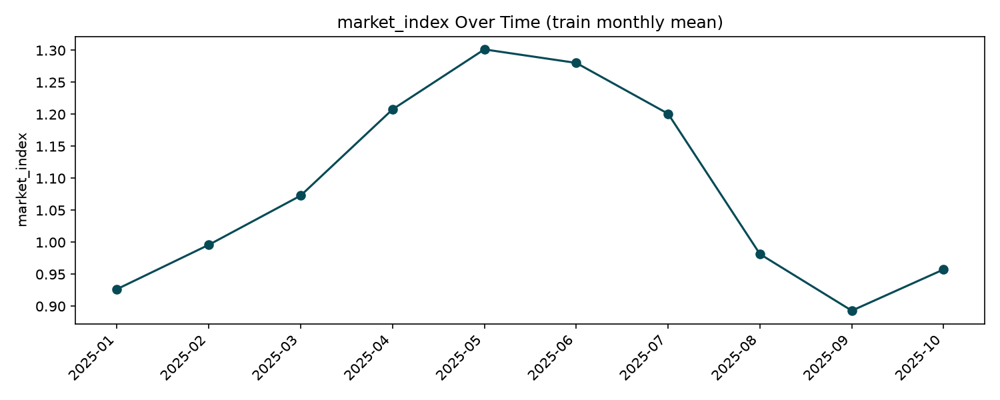

### quote_signal

- Range: 0.692 – 3.610; weak negative correlation with target (−0.04).
- Monthly mean drifts (Jan 2.07 → Jun 2.30 → Oct 1.94).
- Validation distribution slightly narrower (KS = 0.046, statistically significant but small effect).

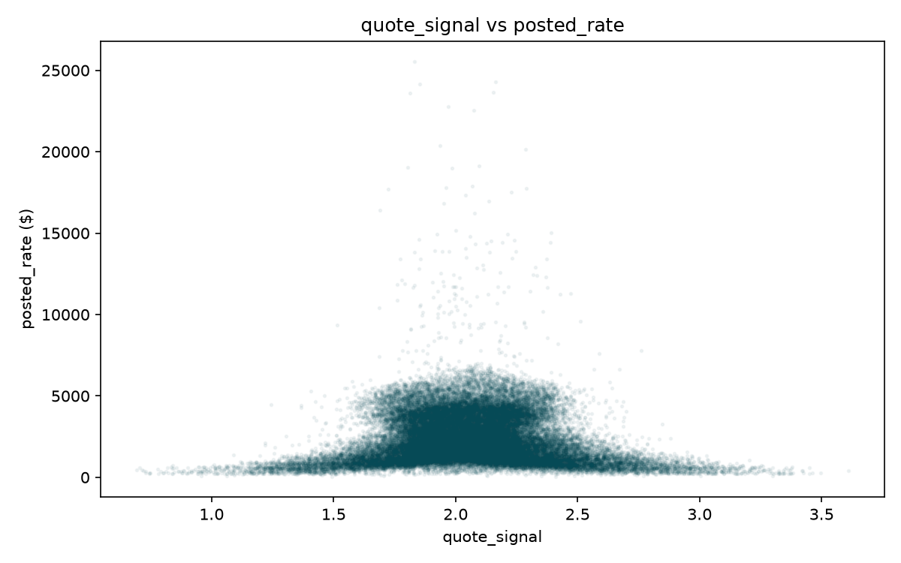

---

## 4. Categorical Features

### pickup / delivery

| | Train | Validation |
|---|---:|---:|
| Unique cities | 64 | 72 |
| Unseen in train | — | 8 cities |
| Rows with unseen pickup | — | 725 (6.0%) |
| Rows with unseen delivery | — | 722 (6.0%) |

**Unseen cities:** Allentown, Charlotte, Chicago, Jackson, Knoxville, Laredo, Norfolk, San Diego.

No training city has fewer than 10 observations (no rare-city problem in train).

**Origin/destination effects:** Substantial spread in mean target by city (e.g., San Francisco pickup mean $4,071 vs Lexington $1,824). These reflect geography/distance mix, not independent city premiums alone.

### Route (`pickup|delivery`)

| Statistic | Value |
|---|---:|
| Unique routes (train) | 4,014 |
| Unique routes (validation) | 4,214 |
| Routes with 1 obs (train) | 67 |
| Routes with 2–5 obs | 691 |
| Routes with 6+ obs | 3,256 |
| Median observations per route | 10 |

Most routes have enough history for **route-level features computed on training fold only**. Route frequency vs within-route target std correlation = 0.074 (weak) — high-frequency routes are not dramatically less variable.

**Do not use target-encoded route statistics from full dataset** — leakage risk.

### equipment

| Equipment | Train count | Mean rate | Median rate | Mean RPM |
|---|---:|---:|---:|---:|
| Dry Van | 27,202 | 2,272 | 1,953 | 2.12 |
| Flatbed | 8,753 | 2,445 | 2,077 | 2.29 |
| Reefer | 12,045 | 2,554 | 2,197 | 2.38 |

Reefer commands highest rates and RPM; equipment is a meaningful stratifier beyond distance.

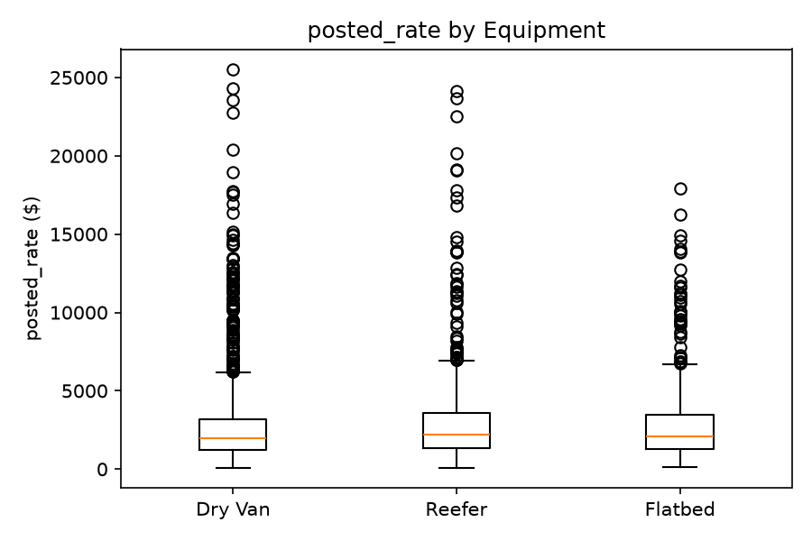

---

## 5. Geographic Analysis

- **City → coordinate mapping is deterministic** (0 inconsistent cities in train).
- Haversine ↔ supplied distance: r = 0.9995.
- Distance / haversine ratio: mean 1.195, median 1.182, std 0.144 (road-distance multiplier).
- Coordinates add **no information beyond city name** for known cities.
- For **8 unseen validation cities**, coordinates provide geographic position when city OHE fails → keep lat/lon as fallback features.
- **Do not replace supplied distance with haversine** — supplied distance is the operational mile count and correlates more strongly with rate.

Existing `src/features.py` adds `haversine_miles` and `distance_vs_haversine` — reasonable as supplementary features, not replacements.

---

## 6. Temporal Analysis

### Load volume

- ~158 loads/day on average (304 unique dates).
- Weekly counts stable (~1,050–1,180 loads/week).
- Monthly counts: 4,337 (Feb) – 5,036 (Mar); no major volume gaps.

### Quarter comparison (train)

| Quarter | Loads | Target mean | Target median | market_index mean | quote_signal mean | distance↔target r |
|---|---:|---:|---:|---:|---:|---:|
| Jan–Mar | 14,291 | 2,302 | 1,977 | 0.999 | 2.116 | 0.917 |
| Apr–Jun | 14,515 | 2,430 | 2,074 | **1.263** | 2.056 | 0.911 |
| Jul–Aug | 9,671 | 2,377 | 2,040 | 1.093 | 1.987 | 0.902 |
| Sep–Oct | 9,523 | 2,392 | 2,044 | **0.926** | 2.069 | 0.904 |

### Generalization assessment

- **Distance ↔ target relationship is stable** across quarters (r ≈ 0.90–0.92).
- **market_index regime changes** are the main temporal risk: Apr–Jun training data reflects a market peak not seen in Sep–Oct or Nov–Dec.
- **Sep–Oct is the best proxy** for Nov–Dec validation on market conditions (market_index means 0.926 vs 0.927).
- Models trained on Jan–Aug only (per `src/config.py`) avoid mid-year market_index peaks in training — **good design**.
- A model trained only on Jan–Mar would underpredict Jun rates but may generalize adequately to Sep–Dec if distance-driven.

---

## 7. Train vs Validation Drift

### Numerical features (KS test, complete cases)

| Feature | KS | Severity | Train mean | Val mean |
|---|---:|---|---:|---:|
| `pickup_lat` | 0.012 | Negligible | 35.65 | 35.57 |
| `pickup_lon` | 0.012 | Negligible | −90.93 | −90.72 |
| `delivery_lat` | 0.010 | Negligible | 35.64 | 35.61 |
| `delivery_lon` | 0.010 | Negligible | −90.86 | −90.91 |
| `distance` | 0.007 | Negligible | 1,136 | 1,142 |
| `weight` | 0.015 | Negligible* | 31,029 | 30,507 |
| **`market_index`** | **0.483** | **Severe**† | **1.083** | **0.927** |
| `quote_signal` | 0.046 | Mild‡ | 2.062 | 2.051 |

\*Statistically significant (p = 0.033) but practically small.  
†Severe on full train vs val; **moderate/negligible when comparing Sep–Oct train to Nov–Dec val**.  
‡Statistically significant (p ≈ 5×10⁻¹⁸) but quantile shifts are small.

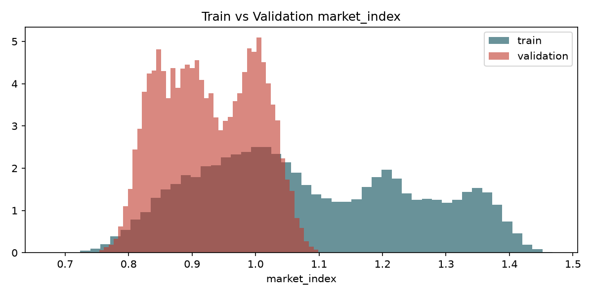

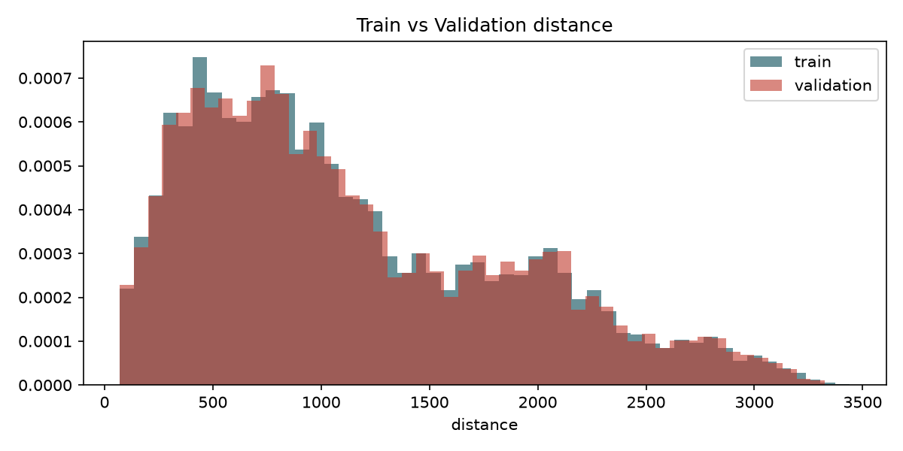

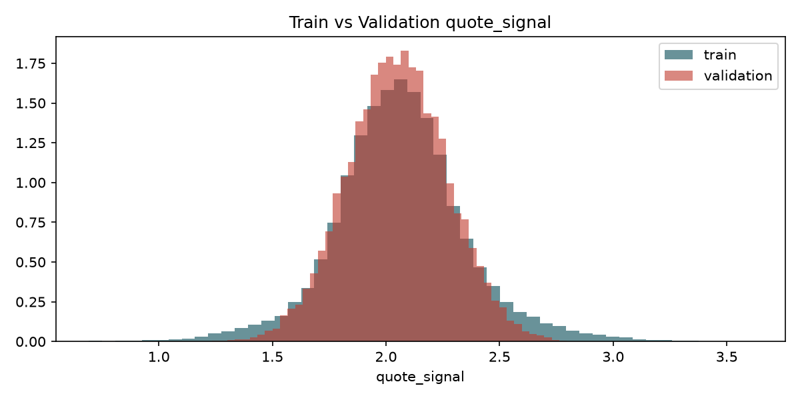

### Categorical drift

| Feature | Unseen categories | Rows affected |
|---|---|---:|
| pickup | 8 cities | 725 (6.0%) |
| delivery | 8 cities | 722 (6.0%) |
| equipment | 0 | 0 |

**Total validation rows touching ≥1 unseen city:** ~1,447 (some rows have both pickup and delivery unseen).

### Handling unseen cities

1. `OneHotEncoder(handle_unknown="ignore")` — already in `src/features.py` ✓
2. Coordinates provide geographic fallback for unseen cities
3. Supplied `distance` remains fully available (not derived from city lookup)
4. Avoid target-encoded city/route statistics without fold-safe computation

---

## 8. Data Quality Issues

### A. Missing weight (300 train / 165 val)

- Missing rate ~0.6–0.7% per month; no strong temporal pattern (0.42–0.76% monthly).
- By equipment (train): Dry Van 175, Reefer 70, Flatbed 55 — proportional to equipment mix.
- Target mean when weight missing: 2,351 vs present: 2,374 (Δ ≈ $23) — **weak target association**.
- **Not strongly structured**, but indicator feature may still help.

### B. Negative weight (292 train / 145 val)

- 275 unique negative values; no zeros.
- Values look like corrupted positive weights (same scale 5,000–47,500, mirrored sign).
- No correlation with target beyond overall population.
- Spread evenly across months and equipment.
- **Not genuine**, not a meaningful sentinel encoding rate class.

### C. Missing market_index (374 train / 249 val)

- ~0.64–0.88% missing per month; slightly elevated in Mar/Jun/Oct (~0.87%).
- By equipment: proportional to mix.
- Missingness does not strongly predict target (similar rate levels).

### D. Unseen validation cities

See Section 4. Eight cities; up to 1,447 validation rows affected when counting pickup or delivery unseen.

---

## 9. Leakage Investigation

| Feature / technique | Available at inference? | Leakage risk | Verdict |
|---|---|---|---|
| `load_id` | Yes | Encodes TR/TE split | **Exclude** |
| `posted_rate` | No (train only) | Target | **Exclude** |
| Raw features (distance, cities, etc.) | Yes | None | Safe |
| `market_index`, `quote_signal` | Yes | None if exogenous at quote time | Safe |
| Calendar date features | Yes | None | Safe |
| Haversine / coord features | Yes | None | Safe |
| Route string (pickup→delivery) | Yes | None | Safe |
| Route/city **target encoding** on full train | — | Uses labels from val period rows if computed globally | **Unsafe without fold + time cutoff** |
| Historical route median rate | Partial | Must use only past data within train fold | Safe only with temporal cutoff |
| `weight_per_mile` in `src/features.py` | Yes | Uses weight/distance before target — safe if weight cleaned first | Safe after cleaning |

**No direct leakage columns found.** Main risks are methodological (target encoding, random CV, using full-dataset aggregates).

---

## 10. Recommended Cleaning

All imputation statistics must be **fit on the training fold only** (Jan–Aug when using the recommended split).

### Negative weight — recommended treatment

**Set negative values to NaN**, then treat as missing.

*Justification:* Non-physical values; 275 unique magnitudes mirroring positive range; no target signal; no zero sentinel pattern.

### Missing weight — recommended treatment

1. Add binary indicator `weight_is_missing`.
2. Impute with **median weight by equipment** (fallback: global median).
3. Fit imputation values on training fold only.

*Justification:* Missingness weakly structured (~0.6%); equipment-stratified median respects Dry Van / Reefer / Flatbed weight differences; indicator captures residual signal.

### Missing market_index — recommended treatment

1. Add binary indicator `market_index_is_missing`.
2. Impute with **median by calendar month** (fallback: global median on train fold).
3. Fit on training fold only.

*Justification:* Strong monthly regime in non-missing values; month-stratified imputation preserves seasonal context better than global median.

### Other

| Issue | Treatment |
|---|---|
| Target outliers | **Keep** — legitimate long-haul loads |
| Categorical unseen cities | `handle_unknown="ignore"` + coordinate fallback |
| Coordinates | Keep; redundant for known cities, useful for unseen |
| Distance | Keep supplied value; add RPM features, not haversine replacement |

---

## 11. Recommended Feature Engineering

Based on EDA, recommended features for Phase 2 (beyond raw columns):

| Feature | Rationale |
|---|---|
| Calendar: month, dow, week, quarter | Seasonal rate drift |
| `distance` (raw) | Primary driver (r = 0.91) |
| `distance` bins or log(distance) | Capture nonlinear RPM decay |
| Rate-per-mile priors by equipment | Strong equipment RPM differences |
| `haversine_miles`, `distance_vs_haversine` | Road-vs-geodesic adjustment; helps unseen cities |
| `route` (pickup→delivery) OHE | Route-specific pricing; 81% routes have 6+ obs |
| `market_index` + missing indicator | Regime signal; critical for temporal generalization |
| `quote_signal` | Weak but available exogenous signal |
| Cleaned `weight` + missing indicator | Weak marginal signal; clean first |
| Equipment OHE | Reefer > Flatbed > Dry Van RPM ordering |

### Conflicts with existing `src/features.py`

| Current behavior | Issue | Recommended change |
|---|---|---|
| Global median imputation for all numerics | Ignores equipment/month structure | Stratified imputation + missing indicators |
| Raw `weight` passed through | Negative values pollute median imputation | Mask negatives to NaN before pipeline |
| `weight_per_mile = weight/distance` | Uses uncleaned weight | Apply after weight cleaning |
| No missing indicators | Loses missingness signal | Add `weight_is_missing`, `market_index_is_missing` |

Document these for Phase 2 — **do not silently change `features.py` in Phase 1**.

---

## 12. Implications for Model Selection

### Top 3 model families for Phase 2

1. **Distance × equipment baselines** — strong sanity check; equipment RPM stratification captures meaningful structure with minimal complexity.
2. **Gradient boosting (HistGradientBoosting)** — handles nonlinear distance RPM decay, interactions, missing values, and heavy-tailed target without outlier removal. Prior artifact results showed best Sep–Oct MAE (~129).
3. **Regularized linear model (Ridge) on engineered features** — interpretable benchmark; may need log(distance) and interaction terms to compete.

Also consider **Random Forest** as a secondary tree benchmark (prior val MAE ~131).

### Why not other approaches

- **Global median / equipment-only median:** R² ≈ 0 on holdout (prior baselines) — useless for distance-driven problem.
- **Random k-fold CV:** Inappropriate — temporal structure and regime drift require chronological validation.
- **Target encoding without time cutoff:** Leakage risk on route/city features.

### Metric

Use **MAE** on Sep–Oct chronological holdout as primary local metric. Report RMSE secondarily; expect RMSE to be sensitive to long-haul tail.

---

## 13. Recommended Validation Strategy

```
train-test.csv (48,000 labeled, Jan–Oct 2025)
├── Train fold:   Jan 1 – Aug 31, 2025  (~37,700 rows)
├── Val fold:     Sep 1 – Oct 31, 2025  (~9,500 rows)   ← local metric here
└── (do not touch labels for model selection beyond this)

validation.csv (12,000 unlabeled, Nov–Dec 2025)  ← final inference only
```

**Rationale:**

1. Mirrors the temporal gap between development data and final holdout (2 months forward).
2. Sep–Oct `market_index` (0.926) matches Nov–Dec validation (0.927) — best regime proxy.
3. Jan–Aug training excludes mid-year market_index peak (Apr–Jun ≈ 1.26) that would not help Nov–Dec prediction.
4. Matches existing `src/config.py` and `src/data.py` — no change needed to split logic.

**Optional sensitivity check in Phase 2:** Compare Jan–Sep train / Oct val to confirm conclusions are stable.

**Do not** use random splits or cross-validate with shuffled folds.

---

## Visualization Index

| # | File | Description |
|---|---|---|
| 1 | `01_posted_rate_distribution.png` | Target histogram |
| 2 | `02_posted_rate_boxplot.png` | Target boxplot |
| 3 | `03_posted_rate_by_month.png` | Monthly mean/median |
| 4 | `04_distance_vs_posted_rate.png` | Scatter |
| 5 | `05_rpm_vs_distance.png` | Nonlinear RPM decay |
| 6 | `06_weight_vs_posted_rate.png` | Weight scatter |
| 7 | `07_market_index_over_time.png` | Monthly market_index |
| 8 | `08_quote_signal_vs_posted_rate.png` | Scatter |
| 9 | `09_equipment_vs_posted_rate.png` | Boxplot by equipment |
| 10 | `10_train_vs_val_market_index.png` | Drift histogram |
| 11 | `11_train_vs_val_distance.png` | Drift histogram |
| 12 | `12_train_vs_val_quote_signal.png` | Drift histogram |

---

## Phase 1 Status

**Complete.** Ready for Phase 2 review. No models trained, no submission files modified.

**Reproduce:** `python scripts/run_phase1_eda.py`
